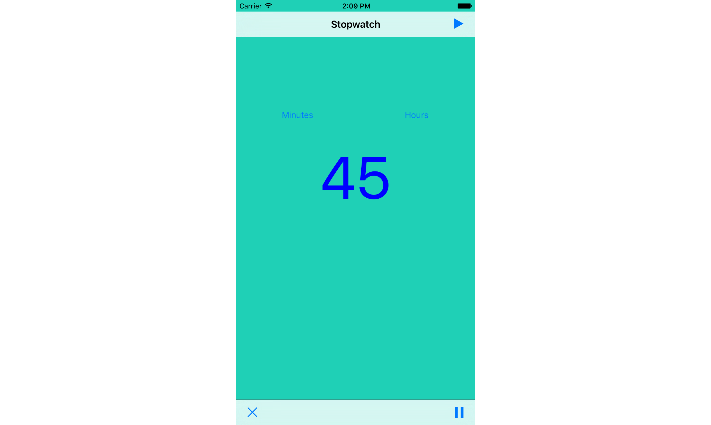

##Stop Watch

iOS app that runs a timer at 1 second intervals when the play button is tapped. Tap pause to pause the timer or reset to start over again at 0. 

Tap minutes to convert the time counter to minutes, likewise for hours.

Built in [Xcode](hhttps://developer.apple.com/xcode/) and written in [Swift](https://developer.apple.com/swift/).

-🍕